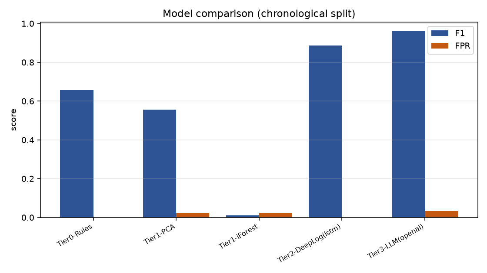
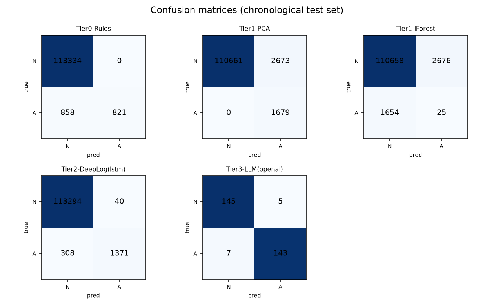
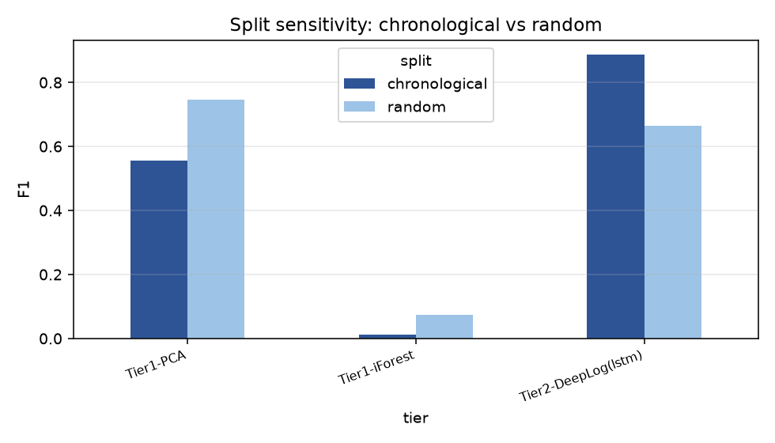

# Detecting Anomalous Sessions in HDFS Logs

**A four-tier benchmark of keyword rules, classical ML, a DeepLog LSTM and an LLM, run on 575,061 real log sessions.**

Production systems often fail quietly. Every individual log line looks fine, but the sequence is wrong, for example an acknowledgement that never arrives or a step that happens out of order. Keyword alerts miss these failures, and tools that over-alert get switched off by the engineers they are meant to help.

This project asks one narrow question. Given all the log lines for a single HDFS block (one "session"), can a model label it Normal or Anomalous accurately, cheaply, and without flooding engineers with false alarms? Four very different approaches are run through one shared pipeline and one shared evaluator, so any difference in the results comes from the model and not from the data handling.

## Headline result

On an honest chronological split, the **DeepLog LSTM is the best detector that scales**. It reaches F1 0.887 (precision 0.97, recall 0.82) and raises only **40 false alarms across 113,334 normal sessions**, a false-positive rate of 0.04%. GPT-4o-mini adds a useful written diagnosis for each flagged session, but it costs about $0.16 per 1,000 sessions, so it belongs in the explanation step rather than the detection step.

**Recommendation.** Detect with the LSTM, then explain only the flagged sessions with the LLM.

## Results (chronological 70/10/20 split, test anomaly rate 1.46%)

| Tier | Approach | Precision | Recall | F1 | False-positive rate |
|---|---|---|---|---|---|
| 0 | Keyword rules (industry baseline) | 1.000 | 0.489 | 0.657 | 0.000 |
| 1 | PCA residual (classical ML) | 0.386 | 1.000 | 0.557 | 0.024 |
| 1 | Isolation Forest (classical ML) | 0.009 | 0.015 | 0.011 | 0.024 |
| 2 | **DeepLog LSTM (deep learning)** | **0.972** | **0.817** | **0.887** | **0.0004** |
| 3 | GPT-4o-mini, few-shot (LLM) * | 0.966 | 0.953 | 0.960 | 0.033 |

\* The LLM was scored on a balanced sample of 300 sessions (150 normal, 150 anomalous) to control API cost, so its F1 is not directly comparable to the other rows. At the real 1.46% anomaly rate, its 3.3% false-positive rate would produce thousands of false alerts. It used about 859 tokens per session.





## What the results show

- **Order carries the signal.** Anomalies usually live in the sequence of events, which counts and keywords cannot see. The LSTM beats the count-based models and cuts false positives by roughly 60 times.
- **Keyword rules are brittle.** They catch fewer than half of the anomalies, and their precision falls from 1.00 to 0.08 on a random sample.
- **PCA never misses an anomaly but over-flags.** It is a cheap, readable safety net where false alarms are acceptable.
- **Isolation Forest does not fit this data.** Anomalies here are not the most statistically isolated points. This held across several feature scalings and contamination settings.
- **The LLM's real value is the explanation.** It returns a one-sentence diagnosis an engineer can act on, which commercial tools such as Splunk ITSI and Datadog Watchdog do not attempt.

Sample explanations from GPT-4o-mini on flagged sessions:

> The session contains an exception during the writeBlock process, indicating a broken sequence.

> The sequence of events shows missing acknowledgments and reordering of events.

All 300 explanations are in [`results/llm_explanations.json`](results/llm_explanations.json).

## Why the split matters

| Tier | F1, chronological split | F1, random split | Change |
|---|---|---|---|
| Keyword rules | 0.657 | 0.141 | -0.516 |
| PCA | 0.557 | 0.745 | +0.188 |
| Isolation Forest | 0.011 | 0.074 | +0.063 |
| DeepLog LSTM | 0.887 | 0.664 | -0.223 |

Anomalies are denser early in the log, so a random split lets a model see the future and reports optimistic numbers. The chronological split mirrors how a live system would actually be used, which is why it is the primary result (consistent with Le and Zhang, 2022).



## Recommended operating design

1. **Detect** every session with the DeepLog LSTM at its low false-positive operating point. It costs almost nothing per session after training.
2. **Explain** only the flagged sessions with GPT-4o-mini, with every response cached, at about $0.16 per 1,000 sessions.
3. **Review.** An engineer receives a flag together with a plain-English reason.
4. **Monitor.** Re-check thresholds periodically, because thresholds tuned on one period transfer imperfectly to a later one.

## How it works

```
LogHub HDFS_v1 (11.2M log lines)
  -> parsing.py / load_preprocessed.py   event templates (29 log keys)
  -> sessionize.py                       one session per block_id, labels, frozen splits
  -> features.py                         event-count vectors and ordered event sequences
  -> tier0_rules.py                      keyword regex baseline
  -> tier1_classical.py                  PCA residual and Isolation Forest
  -> tier2_deeplog.py                    DeepLog LSTM, next-event prediction, top-g detection
  -> tier3_llm.py                        GPT-4o-mini classification and explanation
  -> evaluate.py                         the single metrics function every tier calls
  -> benchmark.py                        all tiers, split ablation, results.csv and figures
```

Key settings live in `src/config.py` (LSTM with 2 layers, 64 hidden units, window h=10, top-g=9, seed 42). All randomness is seeded and splits are frozen, so every tier is scored on exactly the same sessions.

## Run it yourself

```bash
python -m venv .venv && source .venv/bin/activate
pip install -r requirements.txt

# Quick check on generated synthetic data (no download needed)
python run_all.py --synthetic

# Full run on the real dataset
# 1. Download LogHub HDFS_v1 (https://github.com/logpai/loghub) and point HDFS_PRE
#    at its preprocessed folder (Event_traces.csv, anomaly_label.csv, templates)
export HDFS_PRE=/path/to/HDFS_v1/preprocessed
# 2. Optional, for the LLM tier
export OPENAI_API_KEY=your-key-here
python run_all.py
```

The dataset is not included in this repository. It is publicly available from LogHub.

## Limitations

- The LLM tier was evaluated on a 300-session balanced sample for cost reasons. A larger sample at the real anomaly rate would give a sharper estimate of its precision.
- The LSTM was trained for 12 epochs on 1M of the roughly 5.7M available windows. Published DeepLog results reach about 0.96 F1 with full data, so there is headroom.
- Only one dataset (HDFS) was tested. Other systems, such as BGL, are a natural next step.

## About

Designed, coded and benchmarked by **Shivam Ahuja** as part of a Group 10 (Division A) submission for the AI & Analytics Foundation course at SPJIMR Mumbai, July 2026. Built with AI coding assistance. Every number above comes from running this pipeline on the real HDFS_v1 dataset.

## References

1. Du, M., Li, F., Zheng, G., and Srikumar, V. (2017). DeepLog. ACM CCS.
2. Meng, W. et al. (2019). LogAnomaly. IJCAI.
3. Le, V.-H., and Zhang, H. (2022). Log-based anomaly detection with deep learning, how far are we? ICSE.
4. He, S., Zhu, J., He, P., and Lyu, M. R. LogHub. https://github.com/logpai/loghub
